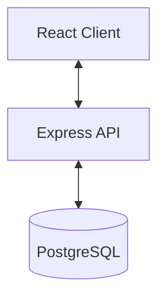

# Architecture Documentation

## System Overview

The Personal Dashboard is a monolithic repository containing a client-server architecture. It is designed to be simple, performant, and easy to extend.

## Frontend Architecture

The frontend is built with **React 19** using **Vite** as the build tool.

- **Styling**: Tailwind CSS 4 is used for utility-first styling.
- **Icons**: Lucide React provides a consistent icon set.
- **State Management**: (To be determined - currently local state/Context).
- **HTTP Client**: Axios is used for API requests.

### Key Directories (Client)
- `src/components`: Reusable UI components.
- `src/pages`: Page-level components / Routes.
- `src/context`: React Context definitions.
- `src/hooks`: Custom React hooks.

## Backend Architecture

The backend is a **Node.js** application using **Express**.

- **API Design**: RESTful API endpoints.
- **Database Interaction**: `pg` library for direct PostgreSQL queries (or potentially an ORM later).
- **Environment**: Managed via `dotenv`.

### Key Directories (Server)
- `routes`: API route definitions.
- `controllers`: Request handling logic.
- `db`: Database connection and utilities.

## Database Schema

*(Proposed Schema - to be finalized)*

### Tables
- `users`: User authentication data.
- `todos`: Task items.
- `lists`: Collections of items.
- `notes`: Text-based notes.

## Development Workflow

1. run `npm run dev` in `client/` for the frontend dev server.
2. run user defined script (e.g. `node index.js`) in `server/` for the backend.
